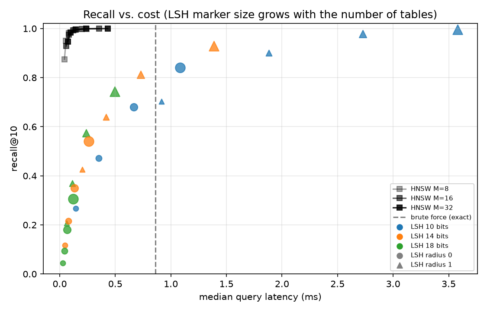
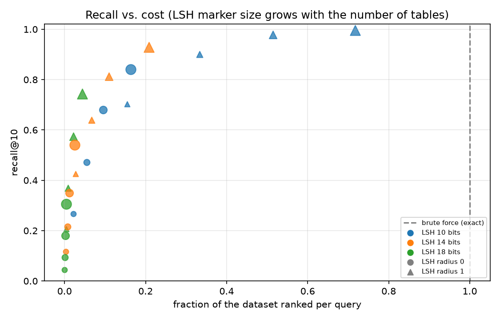

# Visual Search: "Shop the Look"

A visual search engine: give it an image (or a text description) and it returns the most
similar images from a catalog. Images are turned into CLIP embeddings, and the interesting
part of the project is the nearest-neighbor search over them. It compares an exact
brute-force baseline, an LSH index written from scratch, and an HNSW reference
([hnswlib](https://github.com/nmslib/hnswlib)).

Dataset: [Caltech-256](https://data.caltech.edu/records/nyy15-4j048) (29,780 images in 256 object categories, clutter folder excluded).

## Status

- [x] Project setup, CLIP encoder, data and embedding scripts, command-line search
- [x] Exact brute-force index, LSH index (from scratch), HNSW index
- [x] Benchmark harness: recall@k, category precision, latency, memory, build time
- [ ] FastAPI service
- [ ] React + TypeScript frontend
- [ ] Docker, CI, scaling experiment

## Results

1,000 held-out queries against 28,780 indexed images, top-10, 512-dimensional CLIP
(ViT-B/32) embeddings, one query at a time on an Apple M5 (NumPy on CPU). Recall is the share
of the exact top-10 that the index also returned. Category precision is the share of results
in the query's own category, which is what a person would notice.

| index | settings | recall@10 | category precision@10 | p50 ms | p95 ms | images ranked per query | build s |
|---|---|---|---|---|---|---|---|
| brute force | exact | 1.000 | 0.858 | 0.86 | 0.99 | 100% | 0.00 |
| LSH | 16 tables, 14 bits, radius 1 | 0.813 | 0.839 | 0.73 | 1.18 | 10.9% | 0.05 |
| LSH | 32 tables, 14 bits, radius 1 | 0.929 | 0.852 | 1.39 | 1.98 | 20.8% | 0.10 |
| LSH | 32 tables, 18 bits, radius 1 | 0.744 | 0.822 | 0.49 | 0.73 | 4.3% | 0.10 |
| HNSW | M=16, ef_search=20 | 0.975 | 0.860 | 0.08 | 0.12 | n/a | 2.39 |
| HNSW | M=16, ef_search=40 | 0.993 | 0.859 | 0.12 | 0.18 | n/a | 2.39 |
| HNSW | M=16, ef_search=160 | 1.000 | 0.858 | 0.36 | 0.52 | n/a | 2.39 |

Full sweep (24 LSH settings, 15 HNSW settings): [results/results.md](results/results.md) and
[results/results.csv](results/results.csv).




What the numbers show:

- **HNSW is the clear winner at this size.** It reaches 0.993 recall at 0.12 ms, about 7x
  faster than brute force, and 1.000 recall at 0.36 ms.
- **LSH ranks far fewer images but is not faster at high recall.** At 0.9 recall or more it
  was slower than brute force in every setting I tried (for example 1.39 ms at 0.929 recall
  against 0.86 ms). I have not profiled it. A likely reason is that exact search at this size
  is a single optimized matrix-vector product that takes under a millisecond, while each LSH
  query pays for hashing in every table, many small lookups, and gathering candidate vectors
  in Python. The "images ranked" column shows the algorithmic saving; the latency shows what
  that saving costs in practice here. The advantage of LSH should show at larger scale, which
  the planned scaling experiment will test.
- **Approximate search costs little in what users see.** Category precision falls from 0.858
  (exact) to 0.822 for an LSH setting with only 0.744 recall, and stays at 0.86 for HNSW.
- **Memory is dominated by the stored vectors** (59 MB for 28,780 x 512 floats); every index
  stays between 59 and 75 MB.

Caveats: one dataset, one random split (seed 0), one machine, single-query latency measured
from Python. HNSW is built with multiple threads, so its recall can vary slightly between runs.

## Quickstart

Requires [uv](https://docs.astral.sh/uv/).

```bash
uv sync                                    # create the environment
uv run python scripts/download_data.py     # download and unpack Caltech-256 (about 1.2 GB)
uv run python scripts/build_metadata.py    # list images into data/metadata.csv
uv run python scripts/build_embeddings.py  # embed every image with CLIP (downloads about 600 MB of weights)
uv run vsearch --image path/to/photo.jpg   # search by image
uv run vsearch --text "a bright red guitar" -k 5
uv run python scripts/run_benchmark.py     # regenerate results/ (about 30 seconds)
```

Embedding all 29,780 images took about 2.5 minutes on an Apple M5. For a quick trial run, use
`build_metadata.py --limit 2000` before embedding.

## How it works

```
images -> CLIP image encoder -> unit vectors (n x 512) -> Index.build()
query (image or text) -> CLIP encoder -> unit vector -> Index.search(k) -> ranked ids
```

All indexes implement the same `Index` interface (`src/visualsearch/index/base.py`) and
normalize vectors themselves, so cosine similarity is a dot product and any index can be
swapped in.

- `BruteForceIndex` is exact and provides the ground truth for the benchmark.
- `LSHIndex` uses random-hyperplane hashing across several tables. A query collects the
  vectors that share its bucket in any table, then ranks only those by exact cosine
  similarity. `bits_per_table` and `num_tables` trade speed against recall, and
  `hamming_radius=1` also probes buckets one bit away.
- `HNSWIndex` wraps hnswlib's layered neighbor graph.

## Development

```bash
uv run pytest        # 53 tests
uv run ruff check .  # lint
```

Datasets and embeddings live in `data/`, which is git-ignored.
